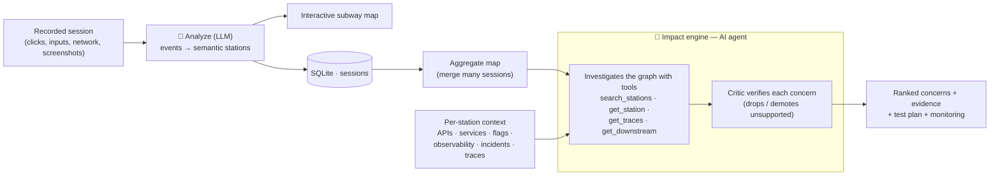
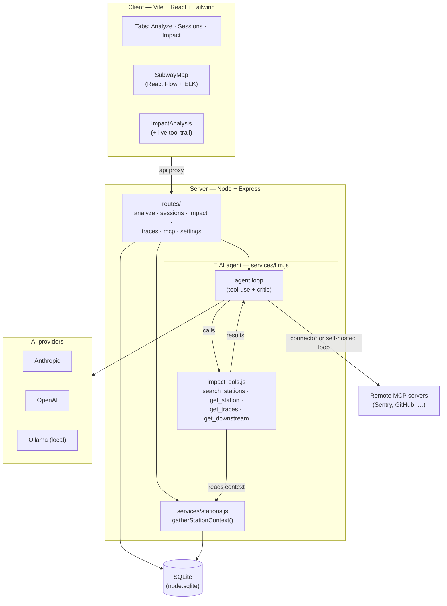
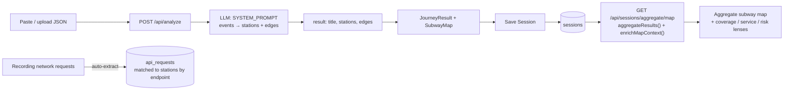
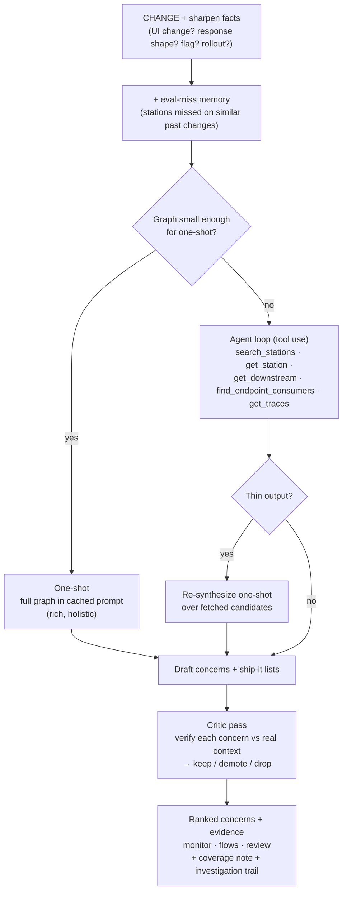
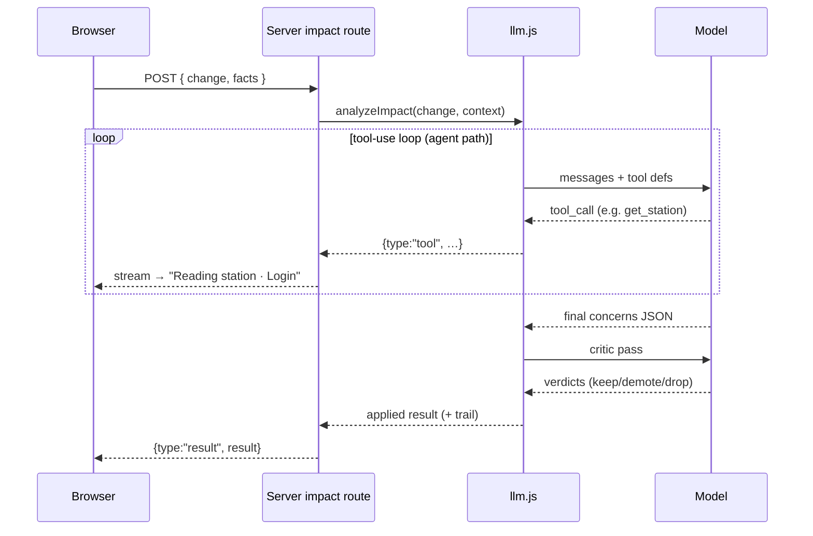
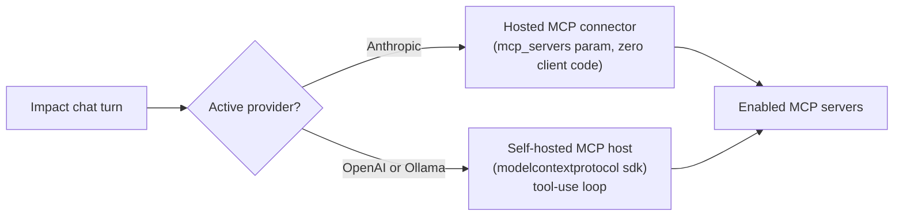
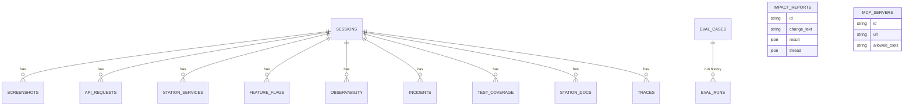

# Journey Map

Turn recorded web sessions into visual user-journey maps, rich per-step context, and an **agentic change-impact engine** — with zero instrumentation on the target app.

You paste or upload a recording (clicks, inputs, network requests, screenshots); an LLM groups the raw events into semantic **stations**; the app lays them out as an interactive subway-style map; and then you can describe a proposed change and get the journeys and stations **at risk** — ranked, evidence-backed, with concrete checks and a test plan.

> **Why:** existing tools each solve one slice — Datadog (observability), Mixpanel (funnels), Playwright (tests). Journey Map ties **user journey + system context + change impact** together, driven by zero-setup recordings and AI semantic grouping.

---

## How it works (the 30-second version)



1. **Record → Analyze.** A recording is sent to an LLM that segments it into *stations* (e.g. *Submit Login Form*, *Load Stories Feed*) with a domain, the actions taken, the APIs called, and the edges between them.
2. **Save → Aggregate.** Saved sessions are merged into one **process map** — the same step seen across recordings collapses into a single canonical station, with edge thickness = visit frequency.
3. **Annotate.** Each station accrues context: screenshots, real request/response samples, backend services, feature flags, observability links, past incidents, test coverage, design docs, and **distributed traces**.
4. **Ask "what breaks if I change X?"** The impact engine investigates the graph and returns ranked, evidence-cited concerns — then a critic verifies them.

---

## Architecture



- **Client** (`client/`) — a single-page React app with three tabs. The map is React Flow with an ELK layout engine; everything talks to the server through the `/api` proxy.
- **Server** (`server/`) — Express routes are thin; the real work lives in `services/`. `stations.js` assembles the cross-session context; `llm.js` is the single funnel for every model call (provider routing, the agentic loop, the critic, caching).
- **Storage** — one local SQLite file via Node's built-in `node:sqlite`. No external DB, no Docker.
- **AI** — pluggable provider (Anthropic / OpenAI / Ollama), chosen at runtime in Settings.
- **MCP** — optional remote tool servers the impact chat can call (see *Integrations*).

---

## The data pipeline: recording → map



**Stations are matched across sessions by a *canonical key*** (domain + normalized label/endpoints), so "Login" in five recordings becomes one station. User edits (merge, rename, recolor) are stored as overrides and applied on top.

---

## The impact engine

The headline feature. Describe a change; get the blast radius. It's **not a single LLM call** — it's a small agent with retrieval tools, a verification critic, memory, and a safety net.

> 📐 **Design deep-dive:** [`docs/impact-engine-design.md`](docs/impact-engine-design.md) — why this is a *size-gated hybrid* (one-shot vs. agent), the tradeoffs, and the threshold/guard rationale.



- **Size-gated hybrid.** Small graphs use a **one-shot** (whole graph in a cached prompt — richer, holistic). Large graphs use the **agent**, which *navigates* the graph via tools instead of being handed all of it (scales past the context wall). A **degenerate-output guard** re-synthesizes from the agent's fetched stations if it ever comes back thin.
- **Critic / verification loop.** A second pass re-checks every concern against the *actual* station context and drops/demotes unsupported ones — turning "confident but unverifiable" into evidence-backed. It prefers *demote* over *drop* to avoid gutting useful precautionary signals.
- **Evidence types.** Each concern cites `endpoint · service · downstream · flag · incident · coverage-gap · doc-stale · trace`. **Trace facts are treated as ground truth** (a trace *proves* a dependency).
- **Memory across runs.** If a similar change under-recalled in a past eval, the expected stations are injected as a hint so the miss isn't repeated.

### Request lifecycle (with the live trail)

`/api/sessions/impact` **streams NDJSON**, so the UI shows tool calls as they happen (Claude-Code-style).



### Cost & reliability layers

Every model call goes through `transport()` in `llm.js`, which applies, automatically:

| Layer | What it does |
|---|---|
| **Prompt caching** | The big context/system block is cached (~90% off on repeats). |
| **App-level memoization** | Identical analysis (same change + context + model) returns instantly, $0. |
| **Smart routing** | On Anthropic, easy tasks (initial analysis, chat) drop to a cheaper model; impact/test-plan honor your chosen model. Never routes *upward*. |
| **Token-param auto-detect** | Learns whether a model wants `max_tokens` or `max_completion_tokens` (o1/o3/gpt-5-era) and retries once. |
| **Tolerant JSON parsing** | Balanced-brace extraction survives prose/fences around the JSON. |

---

## Integrations (MCP)

Connect remote **MCP servers** (Sentry, GitHub, …) in Settings; the impact chat can call their tools on demand.



- Works on **all three providers** — Anthropic via its hosted connector, OpenAI/Ollama via a self-hosted tool loop.
- **Per-server tool allowlisting** (`allowed_tools`) constrains what the model may call. Tokens are stored locally and never returned to the client.

---

## Trust: evals & drift

Turn real analyses into a **golden regression set**, then watch for degradation.

- **Add to evals** from any impact result — pre-fills the *expected* stations from the flagged concerns (minus any you thumbed-down), editable before saving.
- **Run all** executes the suite; each run is recorded with recall/precision.
- **Drift chart** plots suite recall/precision over time (auto-scaled so small movements are visible); each case shows an inline **sparkline** that turns red if recall trends down.

---

## Tech stack

| Layer | Choice |
|---|---|
| Frontend | Vite + React + Tailwind |
| Visualization | React Flow + ELK.js (Mermaid for exports) |
| Backend | Node.js + Express |
| Storage | SQLite via the built-in `node:sqlite` module |
| AI | Anthropic / OpenAI / Ollama, with prompt caching + agentic tool use |
| Integrations | Model Context Protocol (`@modelcontextprotocol/sdk`) |

---

## Prerequisites

- **Node.js 22+** (the server uses the built-in `node:sqlite` module).
- An API key for at least one provider — **Anthropic** (recommended) or **OpenAI** — or a local **Ollama** install for offline use.

## Setup

```bash
# 1. Install client + server dependencies
npm run install:all

# 2. Configure the server environment
cp .env.example server/.env
#    then edit server/.env and add your API key(s)

# 3. Run the API and web client together
npm run dev
```

- Web client: http://localhost:5173
- API server: http://localhost:3001 (the client dev server proxies `/api` here)

### Environment (`server/.env`)

```bash
ANTHROPIC_API_KEY=your_anthropic_key_here   # preferred provider
OPENAI_API_KEY=your_openai_key_here         # optional fallback
PORT=3001                                   # optional, defaults to 3001
```

At least one provider key is required (unless you use Ollama). Switch the active provider/model at runtime from **Settings** in the header.

### In-app Settings

- **Provider & model** — pick Anthropic / OpenAI / Ollama; each remembers its own model. The active provider · model shows as a header pill.
- **Smart routing** (Anthropic) — cheaper model for easy tasks; on by default.
- **Advanced model parameters** — max output tokens, temperature, OpenAI token-limit parameter (`auto`/`max_tokens`/`max_completion_tokens`), Force-JSON toggle.
- **Connected MCP servers** — add/enable/allowlist remote tool servers.

---

## Project structure

```
journey-map/
├── client/                      # Vite + React app
│   └── src/components/          # SubwayMap, StationDetail, ImpactAnalysis,
│                                # EvalChart, McpServers, SettingsModal, …
├── server/
│   ├── routes/                  # analyze, sessions, impact, traces, mcp, settings, …
│   ├── services/
│   │   ├── llm.js               # provider transport, agent loop, critic, caching
│   │   ├── stations.js          # gatherStationContext() across sessions
│   │   ├── impactTools.js       # the agent's retrieval tools over the graph
│   │   ├── impactMemory.js      # eval-miss memory
│   │   ├── prompt.js            # system prompts
│   │   ├── traces.js / mcpHost.js / aggregate.js / …
│   │   └── settings.js
│   ├── db.js                    # SQLite schema + migrations
│   └── data/                    # SQLite DB (gitignored)
├── PLAN.md                      # phased build plan
└── README.md
```

### Scripts

| Command | What it does |
|---|---|
| `npm run install:all` | Install client + server dependencies |
| `npm run dev` | Run API and web client together |
| `npm run dev --prefix server` | API only (`node --watch`) |
| `npm run dev --prefix client` | Web client only |
| `npm run build --prefix client` | Production build of the client |
| `npm test --prefix server` | Server tests (`node --test`) |

---

## Data model

Annotation tables hang off a session+station; evals track their own run history; reports, MCP servers, and settings stand alone.



> Each session stores its own `stations[]` in its `result` JSON; the aggregate map merges them by canonical key at read time. Annotation rows are keyed by `(session_id, station_id)` and matched across sessions by endpoint signature.

---

## Recording format

Recordings are JSON with a `steps[]` array of interaction events (clicks, inputs, navigations, network requests). Screenshots are embedded as steps of `type: "screenshot"` with a `dataUrl` and `region`, matched to stations by timestamp. Distributed traces can be uploaded per station in **OTLP** or **Jaeger** JSON.

> ⚠️ **Recordings and traces capture live network traffic, including `Authorization: Bearer` tokens and response bodies.** They're treated as sensitive: recording files (`step-recording-*.json`, `recordings/`) and the SQLite data dir are gitignored. Don't commit real recordings — sanitize or use throwaway credentials to share one.

---

## Data & privacy

- All data is local in `server/data/sessions.db` (gitignored). Single-user, self-hosted — no auth.
- API keys live only in `server/.env`; MCP tokens live only in SQLite and are never sent to the client.
- Nothing leaves the machine except calls to the AI provider (and any MCP servers) you configure.
```
