# Automating context capture — implementation guide

How to make `gatherStationContext()` fill itself from real sources instead of manual entry.
For the *why*, *roadmap*, and how this unlocks the Improvement Advisor, see
[`automation-and-improvement-advisor.md`](automation-and-improvement-advisor.md). This doc is
the **engineering design**.

---

## Pipeline

```mermaid
flowchart LR
  subgraph sources["Sources"]
    rec["Recording"]
    otel["OTel collector"]
    pd["PagerDuty / Sentry (via MCP)"]
    ci["CI lcov.info"]
    flagsrc["Flag provider API"]
  end

  subgraph connector["Per-source connector"]
    pull["pull()"]
    map["map → canonical station<br/>(endpoint signature / service name)"]
    propose["emit proposal<br/>(tagged by source)"]
    pull --> map --> propose
  end

  sources --> pull
  propose --> review["Review queue<br/>(propose-don't-commit)"]
  review -->|confirm| db[("annotation tables<br/>+ source + status")]
  db --> ctx["gatherStationContext()"]
  ctx --> consumers["Impact engine · map lenses · (future) advisor"]
```



---

## The one principle

```
source  →  map to a canonical station  →  PROPOSE, don't commit
```

Every automated row is **(a) tagged with its source** and **(b) proposed, not authoritative**,
until a human confirms. This is the trust rule from the critical assessment and the Phase 6
Layer-2 caution — derived data must be reviewable and never silently treated as truth.

---

## Data model changes

Several tables already carry a `source` column (`api_requests.source = 'recording' | 'manual'`,
`screenshots.source`). Generalize it:

- Add `source TEXT` to every annotatable table that doesn't have it
  (`incidents`, `feature_flags`, `observability`, `test_coverage`, `station_services`, `traces`):
  values `'recording' | 'otel' | 'pagerduty' | 'sentry' | 'ci' | 'hostnames' | 'flags' | 'manual'`.
- Add `status TEXT NOT NULL DEFAULT 'confirmed'` (manual rows are born confirmed). Automated rows
  insert as `'proposed'`.
- `gatherStationContext()` includes `status: 'confirmed'` by default; proposed rows surface only
  in the **review UI** until accepted (or via an opt-in "include proposed" flag for the impact
  context, clearly labeled).

Migrations follow the existing `migrate()` pattern in `server/db.js` (idempotent `ALTER TABLE`).

---

## Canonical-station mapping (how a signal finds its station)

Reuse what already works:

- **Endpoint signature (preferred).** `endpointKey(method, path)` from `services/endpoints.js`
  normalizes `POST /api/users/123` → `POST /api/users/:id`. Traces and api_requests already match
  this way. Anything with an HTTP endpoint (traces, some incidents, coverage tied to a route) maps
  deterministically.
- **Service name.** Match a derived service to stations whose `services[]` (or trace
  `servicesObserved`) include it.
- **Time window.** For recording-derived signals, the `stationFor(timestamp)` approach
  (`extractApiRequests`) assigns by the station active at that time.
- **LLM-mediated (last resort).** Free-text incident titles, log lines → station. Always
  `status='proposed'`, always tagged — this is the only path that reintroduces the
  unverifiable-data risk, so it must be reviewed.

---

## Connector contract

A connector is small and uniform — pull, map, emit proposals. Sketch:

```js
// services/connectors/<name>.js
export const connector = {
  id: 'otel',
  // Fetch raw items from the source (HTTP pull, file parse, or MCP tool call).
  async pull(input) { /* → RawItem[] */ },
  // Map one raw item to a station + a typed annotation row, or null to skip.
  map(item, ctx) {
    const stationId = matchByEndpoint(item, ctx) ?? matchByService(item, ctx);
    if (!stationId) return null;
    return { stationId, table: 'traces', source: this.id, data: normalize(item) };
  },
};
```

A generic ingest runner: `pull()` → `map()` each → insert with `source` + `status:'proposed'`
→ return a count. One `POST /api/automate/:connectorId/run` route drives any connector; results
land in the review queue.

---

## Connectors (concrete)

### 1. Trace push endpoint  *(do first — highest signal, currently manual)*
- `POST /api/sessions/:id/traces/ingest` accepting OTLP/JSON pushed from an OpenTelemetry
  collector (the `parseTraces()` parser already handles OTLP + Jaeger).
- Map by endpoint signature (the `traces` table already stores `endpoint`). Source `'otel'`.
- Finishes the deferred Phase 5 "push ingest" item. Auto-fills services, downstream calls, p95,
  and error rate — ground truth, zero manual work.

### 2. Service derivation from hostnames  *(cheap)*
- From a recording's `networkRequests[]`, group by hostname → propose a service name per host
  (e.g. `auth.acme.com` → `auth-service`). Map to the stations that called it. Source `'hostnames'`.
- Complements the existing AI `suggestedServices`; this path is deterministic.

### 3. Incident sync  *(Phase 6 Layer-2)*
- Pull from **PagerDuty/Sentry via the MCP host** (`services/mcpHost.js` already connects + calls
  tools) or their REST APIs. Normalize to `{ description, severity, occurred_at, url }`.
- Map deterministically by affected service/endpoint when the incident carries one; fall back to
  LLM mapping of the title (proposed). Source `'pagerduty'`/`'sentry'`, `status:'proposed'`.

### 4. CI test coverage (LCOV)  *(med)*
- Parse `lcov.info` (a `services/lcov.js` stub exists) → covered files. Map files → services
  (path conventions) or → endpoints (route files) → stations. Write `test_coverage` rows, source `'ci'`.
- Best driven from CI: a small `POST /api/automate/coverage` that accepts the lcov body.

### 5. Feature flags  *(lower priority)*
- Pull from LaunchDarkly/Unleash/Flagsmith API; match flag keys to stations by usage/name.
  Source `'flags'`.

---

## Review / confirm UX (propose-don't-commit)

The app already has the pattern to copy:
- **Service suggestions** render as dashed chips with confirm/dismiss (`ServiceList`/`StationChips`).
- API requests imported from a recording show an **`auto`** badge (`ApiRequestList`).

Generalize: a proposed row renders with a "proposed · from `<source>`" badge and **Accept / Dismiss**.
Accept flips `status` to `'confirmed'`; dismiss deletes it. Optionally a per-station "Review
suggestions (N)" affordance, or a global review inbox. Confirmed rows behave exactly like
today's manual ones.

---

## Recommended sequence

1. **Add `source` + `status` columns** + the generic ingest runner + review badges (the shared plumbing).
2. **Trace push endpoint** (`'otel'`) — highest signal, finishes Phase 5.
3. **Hostname service derivation** (`'hostnames'`) — cheap deterministic win.
4. **Incident sync** (`'pagerduty'`/`'sentry'`) via the existing MCP host — high value, currently 100% manual.
5. **LCOV coverage** (`'ci'`).
6. Revisit the **Improvement Advisor** once the above make context rich and evidence-grade.

Value ≈ **signal quality × how manual it is today** — which is why traces and incidents come first.
```
